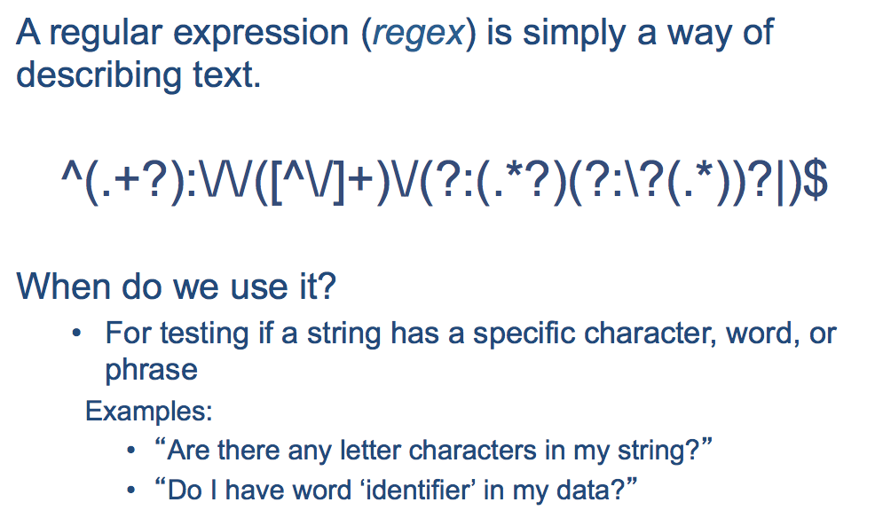
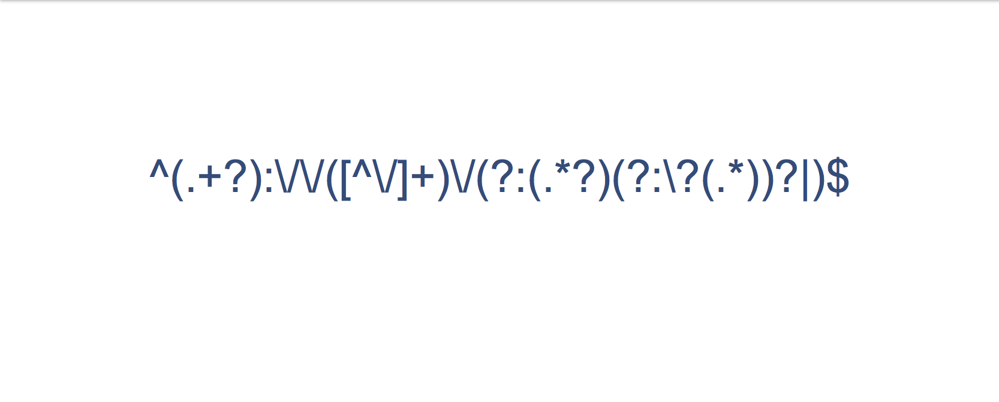
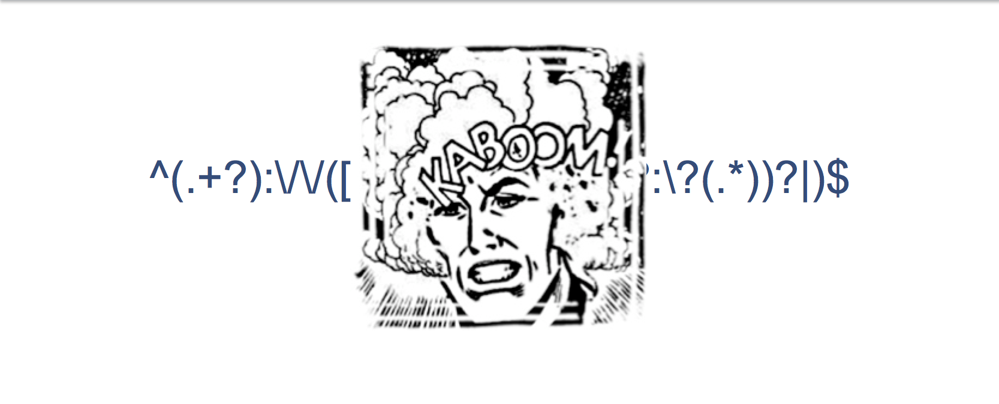
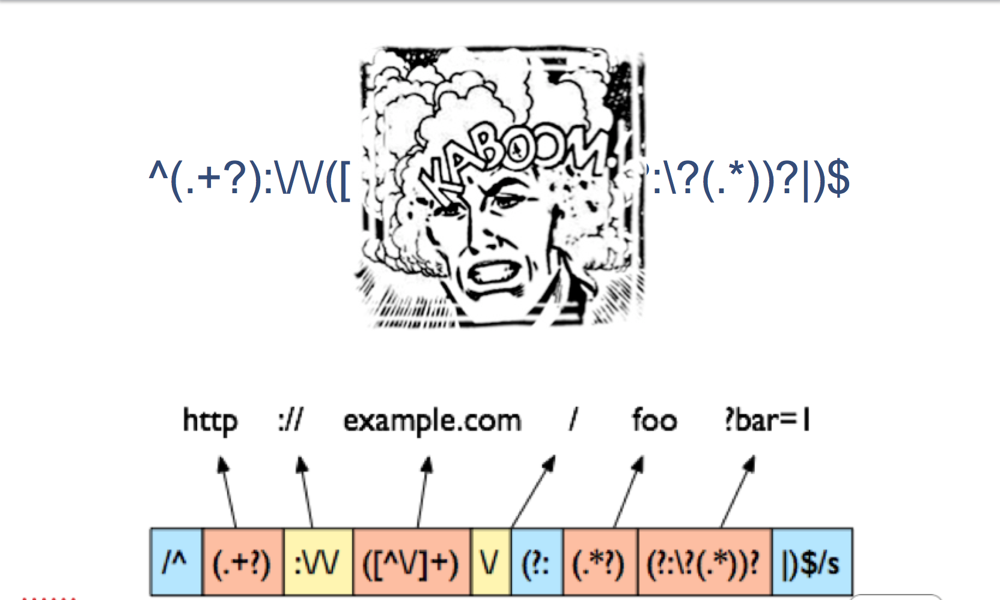

<style>
.reveal column, .reveal column1, .reveal column2 slideContent{
    margin:-20px;
    }
.reveal code .r{
    width:120%
    font:0.8em}
.section .reveal .state-background {
    background: white;}
.section .reveal h1,
.section .reveal p {
    color: black;
    position: relative;
    top: 4%;}
.reveal h1, .reveal h2, .reveal h3 {
  word-wrap: normal;
  -moz-hyphens: none;
}
.small-code pre code {
  font-size: 1em;
}
.midcenter {
    position: fixed;
    top: 50%;
    left: 50%;
}
</style>

Regular Expressions in R
========================================================
author: Ganna Androsova
date: 07-01-2016
font-family: 'Arial'
<br>
<br>
<br>
<br>
<br>

<div style = "font-size:60%">Slides are adapted from presentation "LECTURE 16: REGULAR EXPRESSIONS IN R" by Vinayak Rao</div>

What is a regular expression?
========================================================


What is a regular expression?
========================================================


What is a regular expression?
========================================================


What is a regular expression?
========================================================


Motivation
========================================================
What if we want to match 
- any letter followed by ’n’?
- any vowel followed by ’n’?
- two letters followed by ’n’?
- any number of letters followed by ’n’? 

Regular expressions!
- allow us to match much more complicated patterns 
- build patterns from a simple vocabulary and grammar 

R supports two flavors of regular expressions, we will always use perl(set option **perl = TRUE**)

Search for
========================================================
<div style="text-align:center;color:red">red</div>

bar**red**

**red**is

ti**red**

caught **red** handed

**red**, purple, and blue shirt

Match a word boundary
========================================================
To match word boundary place \\b at the start and the end of the word.

<div style="text-align:center;color:red">\\bred\\b</div>

barred

redis

tired

caught **red** handed

**red**, purple, and blue shirt

Match the beginning of the line
========================================================
<div style="text-align:center;color:red">^red\\b</div>

barred

redis

tired

caught red handed

**red**, purple, and blue shirt

R functions
========================================================
**grep, grepl**: Search for matches of a regular expression/pattern in a character vector; either return the indices into the character vector that match, the strings that happen to match, or a TRUE/FALSE vector indicating which elements match

**sub, gsub**: Search a character vector for regular expression matches and replace that match with another string

Meta characters
========================================================
class:small-code
**.** (period) represents any character except empty string ””


```r
vec <- c('ct', 'cat', 'cart', 'dog', 'rat', 'carert', 'bet')
grep(".at", vec)
```

```
[1] 2 5
```

```r
grep("..t", vec)
```

```
[1] 2 3 5 6 7
```
**+** represents one or more occurrences


```r
grep('c.+t', vec)
```

```
[1] 2 3 6
```

Meta characters
========================================================
class:small-code
\* represents zero or more occurrences


```r
vec 
```

```
[1] "ct"     "cat"    "cart"   "dog"    "rat"    "carert" "bet"   
```

```r
grep('c.*t', vec)
```

```
[1] 1 2 3 6
```
Group terms with parentheses ’(’ and ’)’


```r
grep('c(.r)+t', vec)
```

```
[1] 3 6
```

```r
grep('c(.r)*t', vec)
```

```
[1] 1 3 6
```

Meta characters
========================================================
class:small-code
‘.’ ‘,’ ‘+’ ‘*’ are all metacharacters

Other useful ones include:

ˆ and $ (start and end of line)

```r
vec
```

```
[1] "ct"     "cat"    "cart"   "dog"    "rat"    "carert" "bet"   
```

```r
grep('r.$', vec)
```

```
[1] 3 6
```

Meta characters
========================================================
class:small-code
| ( logical OR )

```r
vec
```

```
[1] "ct"     "cat"    "cart"   "dog"    "rat"    "carert" "bet"   
```

```r
grep('(c.t)|(c.rt)', vec)
```

```
[1] 2 3
```

Character classes
========================================================
**[a-z]** lowercase letters

**[a-zA-Z]** any letter

**[0-9]** any number'

**[aeiou]** any vowel

**[0-7ivx]** any of 0 to 7, i, v, and x

Inside a character class **ˆ** means anything except the following characters. E.g.

**[ˆ0-9]** anything except a digit

Matching metacharacters
========================================================
class:small-code
We saw a bunch of special characters . + * ] [ $ What if we want to match them?

```r
vec2 = c("ct", "cat", "caat", "caart", "caaat", "caaraat", "c.t")
grep('c.t', vec2)
```

```
[1] 2 7
```
Escape them with \


```r
#grep('c\.t', vec) will not work, because R thinks \. is a special character like \n

#Use two \’s
grep('c\\.t', vec2)
```

```
[1] 7
```

Matching metacharacters
========================================================
class:small-code

To match a \, our pattern must represent \\

Our string must contain 4 backslashes!

```r
vec = c("a\\backslash", "nobackslash")
#grep('\\', vec) gives error
grep('\\\\', vec)
```

```
[1] 1
```

Search and replace
========================================================
class:small-code
The **sub** function allows search and replacement:

```r
vec2
```

```
[1] "ct"      "cat"     "caat"    "caart"   "caaat"   "caaraat" "c.t"    
```

```r
sub('a+', 'a', vec2)
```

```
[1] "ct"     "cat"    "cat"    "cart"   "cat"    "caraat" "c.t"   
```
**sub** replaces only first match, **gsub** replaces all

Use backreferences \1, \2 etc to refer to first, second group, etc.

```r
gsub('(a+)r(a+)', 'b\\1brc\\2c', vec2)
```

```
[1] "ct"          "cat"         "caat"        "caart"       "caaat"      
[6] "cbaabrcaact" "c.t"        
```

Search and replace
========================================================
class:small-code
Use \U, \L, \E to make following backreferences upper or lower case or leave unchanged

```r
vec2
```

```
[1] "ct"      "cat"     "caat"    "caart"   "caaat"   "caaraat" "c.t"    
```

```r
gsub('(a+)r(a+)', '\\U\\1r\\2', vec2)
```

```
[1] "ct"       "cat"      "caat"     "caart"    "caaat"    "cUaaraat"
[7] "c.t"     
```

```r
gsub('(a+)r(a+)', '\\U\\1r\\E\\2', vec2)
```

```
[1] "ct"        "cat"       "caat"      "caart"     "caaat"     "cUaarEaat"
[7] "c.t"      
```

Extended list of regular expressions
========================================================
**.** stands for any character.

**[ABC]** means A,B or C.

**[A-Z]** means any upper letter between A and Z.

**[0-9]** means any digit between 0 and 9.

List of metacharacters **‘$ * + . ? [ ] ^ { } | ( ) \’**. If you need to use one of those characters, precede them with a doubled backslash.

Extended list of regular expressions
========================================================
For numbers:

**[:digit:]** Digits: ‘0 1 2 3 4 5 6 7 8 9’.

For letters :

**[:alpha:]** Alphabetic characters: ‘[:lower:]’ and ‘[:upper:]’.

**[:upper:]** Upper-case letters.

**[:lower:]** Lower-case letters.

Note that the set of alphabetic characters includes accents such as é è ê which are very common is some languages like French. Therefore, it is more general than **[A-Za-z]** which does not include letters with accent.

Extended list of regular expressions
========================================================
For other characters :

**[:punct:]** Punctuation characters: ‘! " # $ % & ' ( ) * + , - . / : ; < = > ? @ [ \ ] ^ _ ` { | } ~’.

**[:space:]** Space characters: tab, newline, vertical tab, form feed, carriage return, and space.

**[:blank:]** Blank characters: space and tab.

Extended list of regular expressions
========================================================
For combination of other classes :

**[:alnum:]** Alphanumeric characters: ‘[:alpha:]’ and ‘[:digit:]’.

**[:graph:]** Graphical characters: ‘[:alnum:]’ and ‘[:punct:]’.

**[:print:]** Printable characters: ‘[:alnum:]’, ‘[:punct:]’ and space.

**[:xdigit:]** Hexadecimal digits: ‘0 1 2 3 4 5 6 7 8 9 A B C D E F a b c d e f’.

Extended list of regular expressions
========================================================
You can quantify the number of repetition by adding after the regular expression the following characters :

**?** The preceding item is optional and will be matched at most once.

* The preceding item will be matched zero or more times.

**+** The preceding item will be matched one or more times.

**{n}** The preceding item is matched exactly ‘n’ times.

**{n,}** The preceding item is matched ‘n’ or more times.

**{n,m}** The preceding item is matched at least ‘n’ times, but not more than ‘m’ times.

Extended list of regular expressions
========================================================
class:small-code
**^** to force the regular expression to be at the beginning of the string

**$** to force the regular expression to be at the end of the string

If you want to know more, have a look at the 2 following help files :

```r
?regexp # gives some general explanations
?grep # help file for grep(),regexpr(),sub(),gsub(),etc
```

Concatenating strings
========================================================
class:small-code
**paste()** concatenates strings.
**cat()** prints and concatenates strings

```r
paste("toto","tata",sep=' ')
```

```
[1] "toto tata"
```

```r
paste("toto","tata",sep=",")
```

```
[1] "toto,tata"
```

```r
x <- c("a","b","c")
paste(x,collapse="-")
```

```
[1] "a-b-c"
```

```r
cat(c("a","b","c"), sep = "+")
```

```
a+b+c
```

Splitting a string
========================================================
class:small-code
**strsplit( )** : Split the elements of a character vector ‘x’ into substrings according to the matches to substring ‘split’ within them.
**cat()** prints and concatenates strings

```r
strsplit("a.b.c", "\\.")
```

```
[[1]]
[1] "a" "b" "c"
```

```r
unlist(strsplit("a.b.c", "\\."))
```

```
[1] "a" "b" "c"
```


